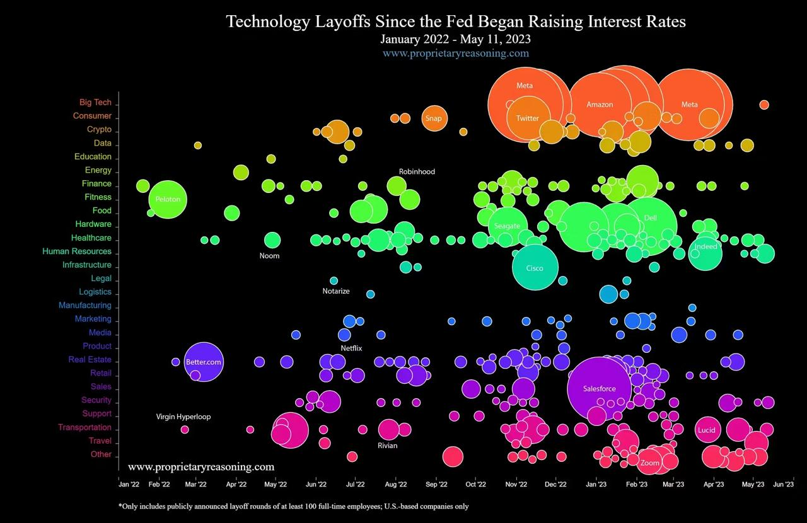

```{r}
#| label: setup
#| include: false
library(knitr)
library(tidyverse)
library(scales)

# Load data
layoffs_raw <- read_csv("layoffs_data.csv", show_col_types = FALSE)

# Clean and prepare data
layoffs <- layoffs_raw |>
  # Parse dates
  mutate(Date = as.Date(Date)) |>
  # Extract year and month
  mutate(
    Year  = year(Date),
    Month = month(Date),
    YearMonth = floor_date(Date, "month")
  ) |>
  # Convert categoricals
  mutate(
    Industry = as.factor(Industry),
    Country  = as.factor(Country),
    Stage    = as.factor(Stage)
  ) |>
  # Drop rows missing both key numeric columns
  filter(!is.na(Laid_Off_Count) | !is.na(Percentage)) |>
  # Remove administrative columns not needed for visualisation
  select(-Source, -Date_Added, -List_of_Employees_Laid_Off)

# Fed rate hike reference dates
fed_hikes <- as.Date(c("2022-03-16", "2022-05-04", "2022-06-15",
                        "2022-07-27", "2022-09-21", "2022-11-02",
                        "2022-12-14", "2023-02-01", "2023-03-22",
                        "2023-05-03"))
```


# Original Visualization {.unnumbered}

## The Visualization We Analysed {.smaller}

<hr>

:::: columns
::: {.column width="58%"}
{width="100%"}
:::
::: {.column width="42%"}

> **"Technology Layoffs Since the Fed Began Raising Interest Rates"**  
> Source: [proprietaryreasoning.com](https://www.proprietaryreasoning.com)  
> Coverage: January 2022 – May 2023, U.S.-based companies only (≥ 100 FTE layoffs)

**What the chart encodes:**

| Visual Channel | Variable |
|----------------|----------|
| X-axis | Date (chronological) |
| Y-axis | Industry sector |
| Bubble size | Employees laid off |
| Colour | Sector grouping |


:::
::: {.callout-note}
<span style="font-size: 1.2em;">
Selected because it directly links macroeconomic policy (Fed rate hikes) to workforce instability — a compelling, socially relevant story worth telling more clearly.
</span>
:::
::::


# Critique of the Original Design

## Strengths

<hr>

:::: columns
::: {.column width="50%"}

**1. Comprehensive Data Representation**
<div style="font-size: 0.85em; color: #1a0909; margin-bottom: 20px;">
Displays layoffs across multiple sectors on a shared timeline, instantly showing *when* and *where* peaks occurred.
<br><br>
</div>

**2. Effective Use of Bubble Size**
<div style="font-size: 0.85em; color: #1a0909; margin-bottom: 20px;">
Bubble size conveys layoff *magnitude*, quickly drawing attention to the major events (e.g., Meta, Amazon).
</div>

:::
::: {.column width="50%"}

**3. Strategic Labeling**
<div style="font-size: 0.85em; color: #1a0909; margin-bottom: 20px;">
Labeling only key companies provides essential real-world context without cluttering the chart.
<br><br><br>
</div>

**4. Clear Chronological Structure**
<div style="font-size: 0.85em; color: #1a0909; margin-bottom: 20px;">
The timeline clearly connects the onset of job losses to rising interest rates, reinforcing the core narrative.
</div>

:::
::::


## Weaknesses

<hr>

:::: columns
::: {.column width="50%"}

**1. Severe Overplotting and Occlusion**
<div style="font-size: 0.85em; color: #1a0909; margin-bottom: 20px;">
Large bubbles (e.g., Meta, Amazon) obscure smaller events. Crowded sectors like Big Tech appear as an undifferentiated mass, hiding within-sector trends.
</div>
<br>

**2. The "Area" Perception Problem**
<div style="font-size: 0.85em; color: #1a0909; margin-bottom: 20px;">
Human perception of 2D areas is unreliable. (Cleveland & McGill, 1984). Without a size legend, viewers cannot make quantitative judgements and remains impressionistic.
</div>
<br>

:::
::: {.column width="50%"}

**3. High Cognitive Load**
<div style="font-size: 0.85em; color: #1a0909; margin-bottom: 20px;">
Viewers must simultaneously decode *position*, *size*, *colour*, and *timeline*, making it harder to extract any single insight.
</div>
<br>

**4. Poor Colour Accessibility**
<div style="font-size: 0.85em; color: #1a0909; margin-bottom: 20px;">
Neon colors on black are inaccessible to colour-vision-deficient viewers. Adjacent overlapping bubbles cause perceptual interference, further reducing legibility.
</div>
<br>

:::
::::


# Proposed Improvements

## Our Redesign Strategy 

<hr>

Each improvement is directly mapped to a specific weakness identified to ensure our changes are purposeful and evidence-based. 

<div style="font-size: 0.85em; margin-bottom: 15px;">
| Weakness | Improvement |
|----------|-------------|
| Overplotting & Occlusion | **Small Multiples** — one panel per major industry sector |
| Area Perception Problem | **Dual encoding** — bubble size *and* colour gradient for layoff magnitude |
| High Cognitive Load | **Panel titles + event annotations** — reference lines for Fed hike dates |
| Poor Colour Accessibility | **ColorBrewer palette** on a light background; shared, labelled legend |
</div>

::: {.callout-note}
Following Tufte's principle of maximising the *data-ink ratio*, our redesign removes visual clutter without losing any information. Every layoff event becomes visible and individually legible.
:::

## Small Multiples Layout

<hr>

**Why Small Multiples?**
<div style="font-size: 0.9em; margin-bottom: 25px; text-align: left; padding: 15px;">
<ul>
<li>Separating each sector into its own panel eliminates occlusion entirely. Consistent axes across all panels allow meaningful cross-sector comparison while preserving within-sector trends that were invisible in the original.</li>
</ul>
</div>

:::: columns
::: {.column width="50%"}
**Original approach (single crowded chart):**
<div style="font-size: 0.85em; padding-left: 10px;">
<ul>
<li> All sectors share one space </li>
<li> Larger bubbles hide smaller ones </li>
<li> Within-sector time trends unreadable </li>
</ul>
</div>

:::
::: {.column width="50%"}
**Our approach (small multiples):**
<div style="font-size: 0.85em; padding-left: 10px;">
<ul>
<li> Each sector in its own panel </li>
<li> Every event is individually visible </li>
<li> Cross-sector comparison remains possible via aligned axes</li>
</ul>
</div>
:::
::::


# Data Source & Engineering

## Data Source

<hr>

**Primary Dataset:**  
[Kaggle — Layoffs Data 2022](https://www.kaggle.com/datasets/theakhilb/layoffs-data-2022)

. . .

```{r}
#| echo: false

tibble(
  Field = c("Company", "Location_HQ", "Industry", "Laid_Off_Count",
            "Date", "Funds_Raised", "Stage", "Country", "Percentage"),
  Description = c(
    "Company name",
    "Headquarters city",
    "Industry sector",
    "Number of employees laid off",
    "Date of layoff announcement",
    "Total funds raised (USD millions)",
    "Company funding stage (e.g. Post-IPO, Series B)",
    "Country of headquarters",
    "Percentage of workforce laid off"
  )
) |>
  knitr::kable()
```

. . .

::: {.callout-note}
Unlike the original visualisation which focused only on U.S.-based companies, this dataset provides a **global perspective**, documenting layoff events internationally from 2022 onwards.
:::


## Data Engineering Workflow

<hr>

**Step 1 — Fix Dates**

Date strings (e.g. `"2024-06-05"`) converted to proper `Date` objects.  
`Year` and `Month` extracted as separate columns for time-series grouping.

. . .

**Step 2 — Remove Unnecessary Columns**

Source URLs, exact log timestamps, and raw employee name lists dropped — reducing noise and improving processing speed.

. . .

**Step 3 — Standardise Categories**

`Industry`, `Country`, and `Stage` converted to `factor` type to prevent silent label-splitting from formatting quirks or typos.

. . .

**Step 4 — Handle Missing Data**

Rows missing **both** `Laid_Off_Count` and `Percentage` were removed. Rows with at least one of the two key values were retained, preserving as much data as possible.

```{r}
#| echo: false
cat("Rows after cleaning:", nrow(layoffs), "\n")
cat("Date range:", format(min(layoffs$Date, na.rm=TRUE)), "to", format(max(layoffs$Date, na.rm=TRUE)))
```


## A Glimpse at the Cleaned Data

<hr>

```{r}
#| echo: true
#| eval: true

layoffs |>
  select(Company, Industry, Country, Date, Laid_Off_Count, Stage, Funds_Raised) |>
  head(8) |>
  knitr::kable()
```


# Improved Visualization

## Monthly Layoff Trend (Time-Series)

<hr>

```{r}
#| echo: false
#| fig-width: 14
#| fig-height: 5

monthly <- layoffs |>
  filter(!is.na(Laid_Off_Count)) |>
  group_by(YearMonth) |>
  summarise(Total_Laid_Off = sum(Laid_Off_Count, na.rm = TRUE),
            Events = n(), .groups = "drop")

ggplot(monthly, aes(x = YearMonth, y = Total_Laid_Off)) +
  geom_col(fill = "#4E79A7", alpha = 0.85) +
  geom_vline(xintercept = as.numeric(fed_hikes), linetype = "dashed",
             colour = "#E15759", alpha = 0.6, linewidth = 0.5) +
  annotate("text", x = as.Date("2022-03-16"), y = max(monthly$Total_Laid_Off) * 0.95,
           label = "Fed rate hikes ↑", colour = "#E15759", hjust = -0.05, size = 3.5) +
  scale_y_continuous(labels = comma) +
  scale_x_date(date_breaks = "3 months", date_labels = "%b %Y") +
  labs(
    title = "Monthly Total Layoffs — Global Tech Sector",
    subtitle = "Red dashed lines mark Federal Reserve interest rate hike dates",
    x = NULL, y = "Employees Laid Off"
  ) +
  theme_minimal(base_size = 13) +
  theme(panel.grid.minor = element_blank())
```

> Layoff volumes escalate sharply following the onset of Fed rate hikes in March 2022, peaking in late 2022 and early 2023.


## Small Multiples by Industry (Top 8 Sectors)

<hr>

```{r}
#| echo: false
#| fig-width: 15
#| fig-height: 7

top_industries <- layoffs |>
  filter(!is.na(Laid_Off_Count)) |>
  group_by(Industry) |>
  summarise(Total = sum(Laid_Off_Count, na.rm = TRUE)) |>
  slice_max(Total, n = 8) |>
  pull(Industry)

sm_data <- layoffs |>
  filter(Industry %in% top_industries, !is.na(Laid_Off_Count))

ggplot(sm_data, aes(x = Date, y = Laid_Off_Count,
                    size = Laid_Off_Count, colour = Laid_Off_Count)) +
  geom_point(alpha = 0.65) +
  geom_vline(xintercept = as.numeric(fed_hikes), linetype = "dashed",
             colour = "#E15759", alpha = 0.4, linewidth = 0.4) +
  facet_wrap(~ Industry, ncol = 4, scales = "free_y") +
  scale_colour_gradient(low = "#AEC6E8", high = "#1F4E79",
                        labels = comma, name = "Laid Off") +
  scale_size_continuous(range = c(1, 8), guide = "none") +
  scale_y_continuous(labels = comma) +
  scale_x_date(date_breaks = "6 months", date_labels = "%b\n%Y") +
  labs(
    title = "Layoff Events by Industry Sector — Small Multiples",
    subtitle = "Bubble size and colour intensity both encode layoff count | Red lines = Fed rate hikes",
    x = NULL, y = "Employees Laid Off"
  ) +
  theme_minimal(base_size = 11) +
  theme(
    panel.grid.minor  = element_blank(),
    strip.text        = element_text(face = "bold", size = 11),
    legend.position   = "right"
  )
```


## Layoffs by Industry — Totals

<hr>

```{r}
#| echo: false
#| fig-width: 13
#| fig-height: 6

industry_summary <- layoffs |>
  filter(!is.na(Laid_Off_Count)) |>
  group_by(Industry) |>
  summarise(Total = sum(Laid_Off_Count, na.rm = TRUE),
            Events = n(), .groups = "drop") |>
  slice_max(Total, n = 12) |>
  mutate(Industry = fct_reorder(Industry, Total))

ggplot(industry_summary, aes(x = Total, y = Industry, fill = Total)) +
  geom_col(show.legend = FALSE) +
  geom_text(aes(label = comma(Total)), hjust = -0.1, size = 3.5) +
  scale_fill_gradient(low = "#AEC6E8", high = "#1F4E79") +
  scale_x_continuous(labels = comma,
                     expand = expansion(mult = c(0, 0.15))) +
  labs(
    title = "Total Employees Laid Off by Industry (Top 12)",
    x = "Total Employees Laid Off", y = NULL
  ) +
  theme_minimal(base_size = 13) +
  theme(panel.grid.major.y = element_blank())
```


## Layoffs by Company Stage

<hr>

```{r}
#| echo: false
#| fig-width: 13
#| fig-height: 5.5

stage_data <- layoffs |>
  filter(!is.na(Laid_Off_Count), !is.na(Stage),
         Stage != "Unknown", Stage != "") |>
  group_by(Stage) |>
  summarise(
    Total       = sum(Laid_Off_Count, na.rm = TRUE),
    Mean_Layoff = mean(Laid_Off_Count, na.rm = TRUE),
    Events      = n(),
    .groups = "drop"
  ) |>
  mutate(Stage = fct_reorder(Stage, Total))

ggplot(stage_data, aes(x = Total, y = Stage)) +
  geom_col(fill = "#76B7B2", width = 0.6) +
  geom_text(aes(label = paste0(comma(Total), " (", Events, " events)")),
            hjust = -0.05, size = 3.5) +
  scale_x_continuous(labels = comma,
                     expand = expansion(mult = c(0, 0.25))) +
  labs(
    title = "Total Layoffs by Company Funding Stage",
    subtitle = "Post-IPO firms account for the largest share of total layoffs",
    x = "Total Employees Laid Off", y = NULL
  ) +
  theme_minimal(base_size = 13) +
  theme(panel.grid.major.y = element_blank())
```

> Post-IPO companies — facing public market pressure — drove the most layoffs, suggesting publicly listed firms responded most aggressively to tightening financial conditions.


# Data Analysis

## Time-Series: Before vs. After Rate Hikes

<hr>

```{r}
#| echo: false

hike_start <- as.Date("2022-03-16")

before_after <- layoffs |>
  filter(!is.na(Laid_Off_Count)) |>
  mutate(Period = if_else(Date < hike_start, "Before Hikes", "After Hikes")) |>
  group_by(Period) |>
  summarise(
    Total_Laid_Off  = sum(Laid_Off_Count, na.rm = TRUE),
    Avg_Monthly     = round(sum(Laid_Off_Count, na.rm = TRUE) /
                              n_distinct(floor_date(Date, "month")), 0),
    Events          = n(),
    .groups = "drop"
  )

before_after |>
  mutate(across(c(Total_Laid_Off, Avg_Monthly), comma)) |>
  knitr::kable(
    col.names = c("Period", "Total Laid Off", "Avg / Month", "Events"),
    align = "lrrr"
  )
```

. . .

```{r}
#| echo: false
#| fig-width: 12
#| fig-height: 4

monthly_period <- layoffs |>
  filter(!is.na(Laid_Off_Count)) |>
  mutate(Period = if_else(Date < hike_start, "Before Hikes", "After Hikes")) |>
  group_by(YearMonth, Period) |>
  summarise(Total = sum(Laid_Off_Count, na.rm = TRUE), .groups = "drop")

ggplot(monthly_period, aes(x = YearMonth, y = Total, fill = Period)) +
  geom_col() +
  scale_fill_manual(values = c("Before Hikes" = "#AEC6E8", "After Hikes" = "#1F4E79")) +
  scale_y_continuous(labels = comma) +
  scale_x_date(date_breaks = "3 months", date_labels = "%b %Y") +
  geom_vline(xintercept = as.numeric(hike_start), colour = "#E15759",
             linewidth = 1, linetype = "solid") +
  labs(x = NULL, y = "Employees Laid Off", fill = "Period") +
  theme_minimal(base_size = 12)
```


## Funds Raised vs. Layoff Count

<hr>

```{r}
#| echo: false
#| fig-width: 12
#| fig-height: 5.5

corr_data <- layoffs |>
  filter(!is.na(Laid_Off_Count), !is.na(Funds_Raised),
         Funds_Raised > 0, Laid_Off_Count > 0)

cor_val <- cor(corr_data$Funds_Raised, corr_data$Laid_Off_Count, use = "complete.obs")

ggplot(corr_data, aes(x = Funds_Raised, y = Laid_Off_Count)) +
  geom_point(alpha = 0.35, colour = "#4E79A7", size = 2) +
  geom_smooth(method = "lm", colour = "#E15759", se = TRUE, linewidth = 1) +
  scale_x_log10(labels = comma) +
  scale_y_log10(labels = comma) +
  labs(
    title = "Funds Raised vs. Layoff Count (log–log scale)",
    subtitle = paste0("Pearson r = ", round(cor_val, 3),
                      " — companies with more capital tend to have larger absolute layoffs"),
    x = "Funds Raised (USD millions, log scale)",
    y = "Employees Laid Off (log scale)"
  ) +
  theme_minimal(base_size = 13)
```

> A modest positive correlation exists — larger, better-funded companies tend to report larger absolute layoffs, consistent with the scale of their workforces.


# Insights & Conclusion

## Key Insights

<hr>

:::: columns
::: {.column width="50%"}

**Temporal Escalation**
<div style="font-size: 0.85em; margin-bottom: 20px;">
Layoffs surged significantly *after* the first rate hike in March 2022, empirically supporting the original chart's core narrative.
</div>
<br>

**Sector Vulnerability**
<div style="font-size: 0.85em; margin-bottom: 20px;">
Consumer tech, retail, and finance sectors show the highest absolute layoff counts. Our small multiples reveal that the *timing* of layoff peaks also differs by sector — a nuance entirely hidden in the original.
</div>
:::
::: {.column width="50%"}

**Stage Matters**
<div style="font-size: 0.85em; margin-bottom: 20px;">
Public, post-IPO companies drove the majority of layoffs, appear to respond aggressively to tightening conditions and quarterly earnings pressures.
</div>
<br>

**Capital & Scale**
<div style="font-size: 0.85em; margin-bottom: 20px;">
Layoffs positively correlate with funds raised. This reflects scale rather than recklessness: larger firms simply had more jobs to cut.
</div>

:::
::::


## Conclusion

<hr>

> Our redesign moves from a single, cluttered bubble chart to a **small multiples layout** that makes every layoff event visible, legible, and comparable across sectors.

. . .

**What we improved:**

- ✅ Overplotting eliminated via panel-per-sector layout
- ✅ Magnitude judgement aided by dual encoding (size + colour gradient)
- ✅ Cognitive load reduced through panel titles and Fed hike annotations
- ✅ Accessibility improved with ColorBrewer palette on a light background

. . .

**What the data tells us:**

The Federal Reserve's 2022 rate hike cycle coincided with a dramatic and sustained escalation in tech-sector layoffs globally — a pattern that is only clearly visible once the visualization is redesigned to let the data breathe.

. . .

::: {.callout-note}
All source code, cleaned data, and rendered HTML outputs are included in the project ZIP package for full reproducibility.
:::


# Appendix {.unnumbered}

## Team Contributions {.unnumbered}

<hr>

| Team Member | Contributions |
|-------------|--------------|
| **Liew Jia Rong** | Dataset cleaning, transformation, and EDA |
| **Alyssa Kwek Li Yun** | Visualization story, critique strengths & weaknesses |
| **Su Myat Nhwe** | Trend validation, EDA, supporting visualizations |
| **Woo Wei Qin** | Translated improvement ideas into proposal; EDA |
| **Teo Xue Ling Sharlene** | Critique analysis, improved visualization design |
| **All Members** | RevealJS presentation preparation; MP4 recording |


## References {.unnumbered}

<hr>

- Cleveland, W. S., & McGill, R. (1984). Graphical perception: Theory, experimentation, and application to the development of graphical methods. *Journal of the American Statistical Association, 79*(387), 531–554.

- Tufte, E. R. (2001). *The Visual Display of Quantitative Information* (2nd ed.). Graphics Press.

- Layoffs dataset: [Kaggle — Layoffs Data 2022](https://www.kaggle.com/datasets/theakhilb/layoffs-data-2022)

- ColorBrewer: [colorbrewer2.org](https://colorbrewer2.org)
